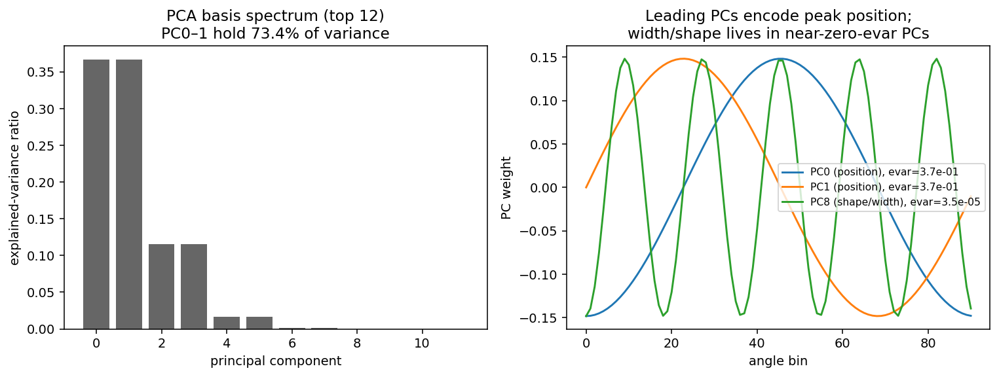
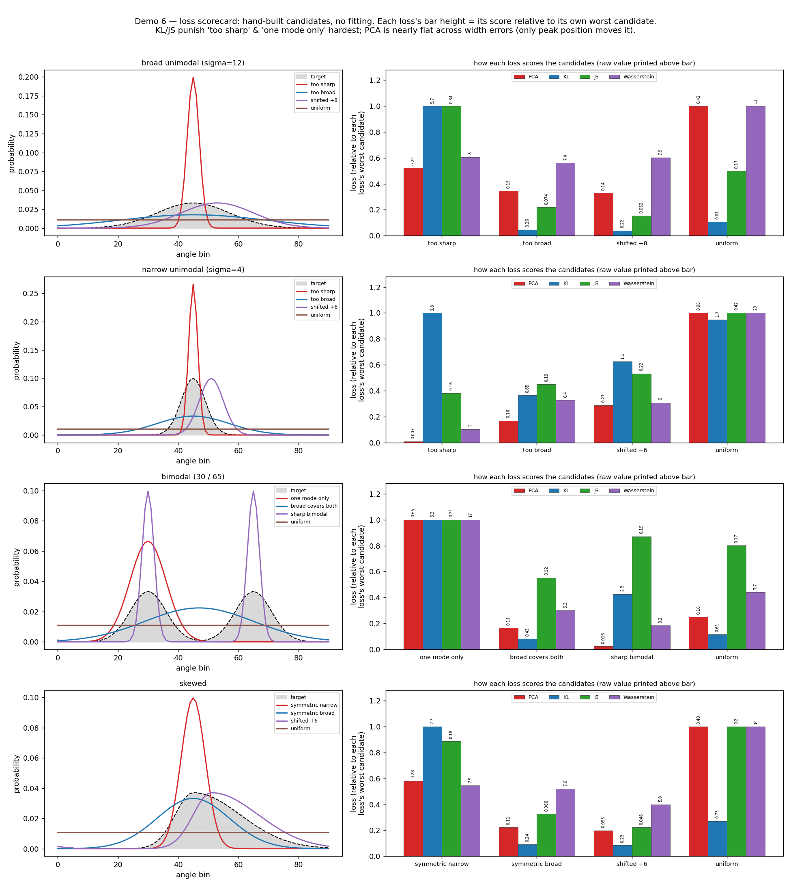
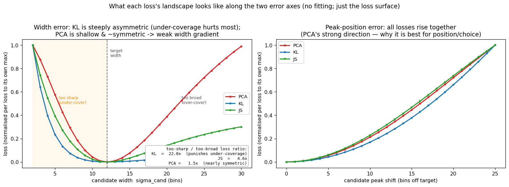
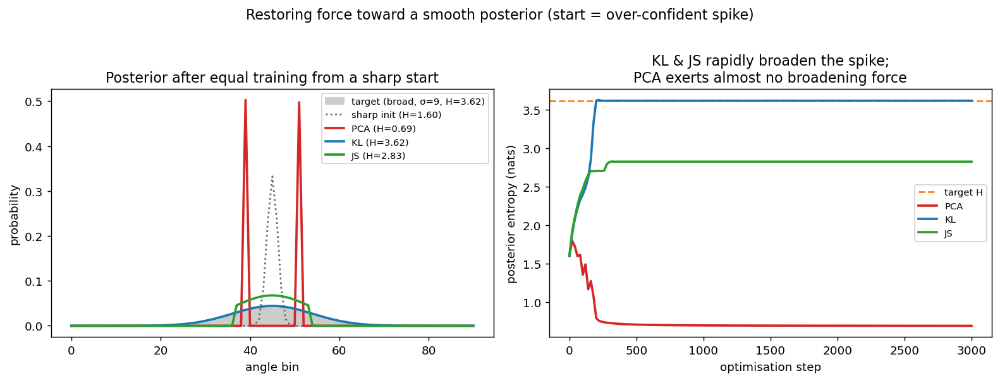
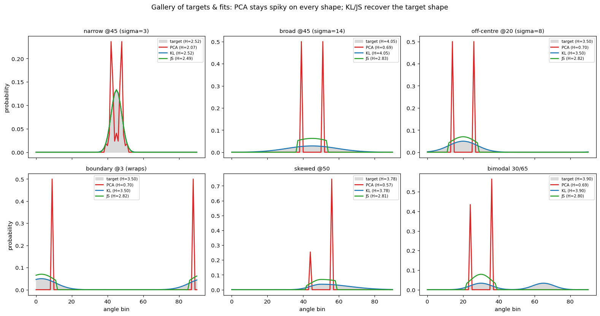
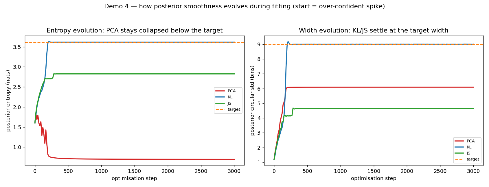
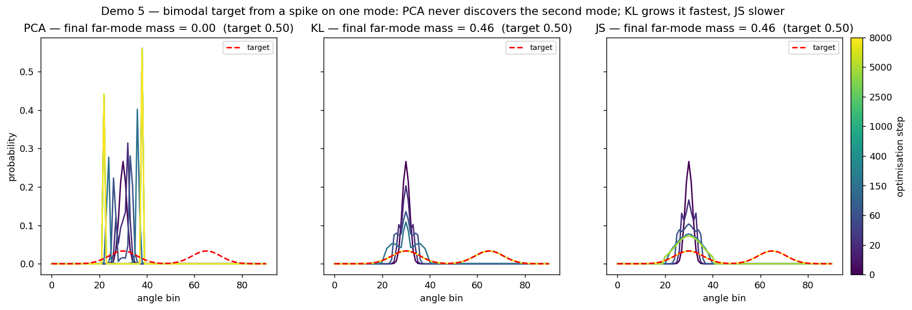
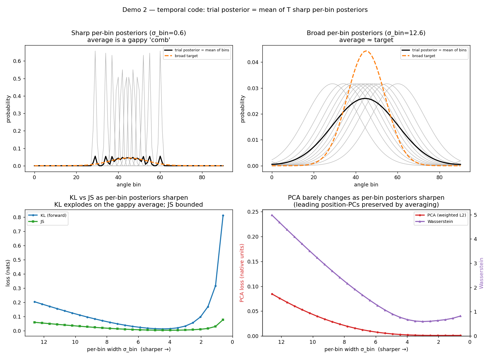
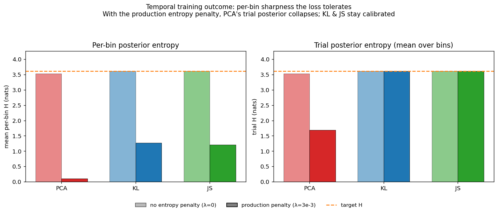

# Why the PCA fit-loss produces peaky posteriors (KL and JS do not)

*Date: 2026-05-29. Self-contained report — figures live next to this file, so
the whole folder can be dropped into a research vault with working image links.
Reproduce with `nn_decoder/diagnostics/loss_smoothness_demo.py`.*

## TL;DR

The PCA fit-loss is a **variance-weighted L2 distance** between the predicted
and target distributions — not a divergence. Two consequences make it produce
peaky (over-confident, low-entropy) posteriors where KL and JS stay calibrated:

1. **No anti-collapse term.** Forward KL `Σ target·log(target/pred)` blows up
   wherever `pred→0` but `target>0`, *forcing* the prediction to cover the
   target's spread. JS (bounded, via the mixture `M=½(P+Q)`) similarly resists
   collapse. L2 only pays `(small)²` for zeroing a bin, so it exerts almost no
   restoring force on an over-confident prediction.
2. **The `evar` weighting discards width.** The basis is fit on
   condition-averaged bumps; the leading PCs (large `evar`) encode **peak
   position**, while bump **width/shape** lives in trailing, near-zero-`evar`
   PCs. So the loss's gradient along the broadening direction is scaled by
   `evar_trailing ≈ 0` — the network is never pushed to get the width right.

These two effects are individually mild but compound badly in the **temporal
(sampling) decoder**, where a trial posterior is the *average of sharp
per-time-bin posteriors* and a per-bin **entropy penalty actively rewards
sharpness**. PCA is indifferent to the resulting gappy average (it preserves
the leading position-PCs); forward KL is not (the gaps make it explode); JS is
in between. So under the production objective PCA's trial posterior collapses
while KL/JS remain calibrated.

## The code being analysed

| Loss | Definition | Source |
|------|------------|--------|
| PCA  | `100·Σ_k evar_k·(proj_pred_k − proj_target_k)²`, all PCs kept ⇒ pure rotation ⇒ variance-weighted `‖pred−target‖²` | `pca_loss.pca_distance` (`pca_loss.py:122,127`); torch twin in `nn_classifier.custom_loss_all_H` (`:192`) |
| KL   | forward `D(target‖pred) = cross_entropy(pred,target) − H(target)` | `nn_classifier.KL_calc` (`:26-32`) |
| JS   | `½D(P‖M)+½D(Q‖M)`, `M=½(P+Q)`, bounded by `log 2` | `nn_classifier.JS_calc` (`:34-43`) |

*(Code locations are anchored on function names; line hints are approximate and
may drift.)* PCA basis is fit with `sklearn PCA()` (all components) on
**condition-averaged target bumps** — `time_binned_ppc.fit_pca_basis`, and
`run_experiment.fit_pca_basis` (called at `run_experiment.py:479`).

Temporal aggregation (`model_type='sampling'`): per-bin posteriors `(T, n_cats)`
→ **trial posterior = mean over bins** (`custom_loss_all_H`, `nn_classifier.py:146`;
eval forward in `evaluate_model_entropy`, `:247`). The target is **one broad bump
replicated across all bins** (`run_experiment.py:430`, `np.repeat(…, T, axis=2)`).
The entropy penalty acts on **per-bin** entropy (`custom_loss_all_H`,
`nn_classifier.py:143,149`, production `entropy_lambda=3e-3`), pushing each bin sharp.

## The basis: leading PCs are position, width is unweighted



PC0–1 hold **73%** of the variance and are smooth, low-frequency
sine/cosine shapes — they encode **where the bump is**. Bump width/shape lives
in high-frequency PCs whose `evar` is negligible (e.g. PC8 `evar ≈ 3.5e-5`,
~10⁴× smaller than PC0). The PCA loss weights each squared error by `evar`, so
it barely "sees" the width dimension.

## Demo 0 — the loss itself, no fitting: scorecards

Before any network or optimiser, the cleanest way to build intuition is to take
a few example **target** posteriors, pair each with a handful of hand-built
**candidate** predictions, and just **read off the loss each candidate gets**.
This shows what every loss rewards and punishes — i.e. the direction its
gradient would push the weights — with nothing else in the way.



For each target the bar height is that loss's score relative to its own worst
candidate (the raw value is printed above each bar). Reading across the cards:

- **"Too sharp" / "one mode only" is the worst mistake for KL and JS**, by a
  wide margin. These are under-coverage errors — the candidate puts ~0 mass
  where the target has mass — and the `log` inside KL blows up there.
- **PCA barely distinguishes width errors at all.** "Too sharp" and "too broad"
  get small, similar PCA losses; the only candidate PCA strongly penalises is
  the **shifted** one (wrong peak position) and, for the bimodal target, the
  **single-mode** one (wrong position of half the mass).
- **Over-coverage is cheap for everyone** but cheapest, relatively, for PCA.

### Demo 0b — the asymmetry that sets the gradient direction

Sweeping a single candidate's **width** and its **peak position** against one
broad target makes the mechanism explicit:



| Error axis | KL | JS | PCA |
|------------|----|----|-----|
| **width**: too-sharp ÷ too-broad loss | **22×** | 4.6× | **1.5×** |
| **peak shift** | steep | steep | steep |

The **width panel** is the whole story in one picture: KL's curve is steep and
strongly **asymmetric** — being too sharp (under-covering) costs ~22× more than
being equally too broad — so KL always has a strong gradient pushing the
prediction *wider*. PCA's width curve is shallow and nearly **symmetric** about
the target, so its width-direction gradient is weak in both directions. Whatever
other pressure exists (the per-bin entropy penalty, finite training) then
dominates the width, and the posterior is free to stay sharp. The **shift
panel** shows all three losses rise together with peak-position error — that is
PCA's *strong* direction, and why it is the best loss for position/choice
readouts.

Everything after this point (Demos 1–2b) just confirms, with actual gradient
descent, that weights evolve the way these static loss surfaces predict.

## Demo 1 — restoring force toward a smooth posterior

With the *full* basis, the weighted-L2 optimum is the target itself, so given
unlimited steps every loss reaches it. The real decoder has finite
capacity/training, so what matters is the **restoring force** each loss applies
to an over-confident posterior. Starting from a sharp spike at the correct
location and training each loss equally:



| Loss | posterior entropy after equal training |
|------|----------------------------------------|
| sharp init | 1.60 nats |
| **PCA** | **0.69** (stayed peaky — even sharpened) |
| JS | 2.83 (broadened most of the way) |
| KL | 3.62 (= target, fully broadened) |

KL and JS rapidly broaden the spike back to the target; **PCA exerts almost no
broadening force** — its gradient on the width direction is ≈0, so the
over-confident posterior is left essentially untouched.

### More example targets and fits

The same restoring-force test across six target shapes (narrow, broad,
off-centre, boundary-wrapping, skewed, bimodal), each started from a sharp spike
at its mode:



PCA stays a spike on **every** shape (final entropy ≈ 0.6–2.1 nats regardless of
target), while KL recovers each target's entropy almost exactly and JS recovers
most of it. The shape of the target is irrelevant to PCA — it only restores the
leading position-PCs.

### How smoothness evolves during fitting

Tracking the posterior's entropy and circular width at every optimisation step
(same broad target, sharp start):



KL climbs to the target entropy/width within ~200 steps and stays there; JS
settles a bit below; **PCA flatlines well under the target and never recovers**.
This is the dynamic view of "PCA exerts no broadening force."

### Evolution on a bimodal target

A harder case: a two-mode target, started from an over-confident spike on the
left mode only — the right mode must be *discovered*:



Final mass on the far (right) mode, against the target's measured far-mode
mass of 0.46 (the nominal 50/50 mixture leaks ~0.04 outside the measurement
window) — so KL/JS reaching 0.46 is *exact* recovery:

| Loss | far-mode mass | final entropy |
|------|---------------|---------------|
| **KL** | **0.46** (both modes recovered) | 3.90 |
| **JS** | **0.46** (both modes recovered) | 3.90 |
| **PCA** | **0.00** (never discovers the 2nd mode) | 0.69 |

KL and JS grow the missing mode and recover the full bimodal target; **PCA never
puts any mass on the second mode** and stays a single spike — the same
no-restoring-force failure, made visual.

## Demo 2 — the temporal regime: averaging sharp per-bin posteriors

A trial posterior is the mean of `T=12` per-bin posteriors. As the per-bin
posteriors sharpen, their average becomes a gappy "comb"; as they broaden, the
average approaches the smooth target.



Loss of the averaged trial posterior against the broad target, broad vs sharp
per-bin:

| Loss | broad per-bin | sharp per-bin | change |
|------|---------------|---------------|--------|
| **PCA** | 0.085 | 0.0011 | **−99% (does not suffer; even improves)** |
| **KL (forward)** | 0.204 | 0.812 | **+298% (suffers a lot)** |
| **JS** | 0.059 | 0.078 | **+31% (suffers less)** |
| Wasserstein | 4.99 | 0.82 | −83% |

This is exactly the predicted ordering: **KL ≫ JS ≫ PCA**. KL explodes on the
gappy average (near-zero bins where the target has mass); JS is bounded so it
only rises moderately; PCA is indifferent because averaging preserves the
leading position-PCs it actually weights.

## Demo 2b — what each loss tolerates during temporal training

Optimising `T` per-bin posteriors through the *real* sampling objective
(`custom_loss_all_H`, with and without the production entropy penalty):



With the production `entropy_lambda=3e-3`:

| Loss | mean per-bin entropy | **trial posterior entropy** |
|------|----------------------|------------------------------|
| **PCA** | 0.10 (per-bin collapse to spikes) | **1.68 (peaky)** |
| KL | 1.27 | 3.62 (= target) |
| JS | 1.21 | 3.61 (= target) |
| *target* | — | 3.62 |

The entropy penalty pushes every loss's per-bin posteriors toward sharpness.
KL and JS supply a strong enough broadening gradient on the trial average to
resist it, so their **trial** posteriors stay calibrated. PCA's broadening
gradient is ≈0, so the penalty wins and the **trial posterior collapses** —
reproducing the observed peakiness. (Without the penalty, `λ=0`, all losses
keep the trial posterior near the target, confirming the penalty is the trigger
the weak PCA gradient fails to counter.)

## Takeaway

- **PCA is not "broken" — it optimises peak *position*, not posterior *width*.**
  For peak-position / choice-readout tasks it is in fact the best of the four
  losses (it weights the leading position-PCs and resists peak drift — see the
  shift panel of `fig9` above), and it is robust to the temporal-averaging regime.
- **It is the wrong loss when calibrated posterior width matters.** If you need
  the trial posterior's *spread* to be meaningful (uncertainty quantification),
  the `evar` weighting throws that information away and the entropy penalty then
  collapses it.

### If calibrated width is needed — options
- Use **KL or JS** for the fit-loss (they punish under-coverage directly).
- **Flatten/clip the `evar` weighting** (e.g. `evar → evar^p`, `p<1`, or a floor)
  so trailing/width PCs are no longer ~0-weighted — this restores a width
  gradient while keeping the position emphasis.
- Add an explicit **width / entropy-matching term** (penalise
  `|H(pred) − H(target)|`) alongside PCA.
- For sampling models, **drop or reduce the per-bin entropy penalty**
  (`entropy_lambda`, `custom_loss_all_H`, `nn_classifier.py:149`) so it stops manufacturing sharp
  per-bin posteriors that PCA then tolerates.

## Reproduce

```bash
pip install numpy scipy scikit-learn matplotlib torch
cd nn_decoder && python diagnostics/loss_smoothness_demo.py
# figures + metrics.csv -> figures/loss_smoothness_demo/
```

Regression check: `python -m pytest tests/test_loss_smoothness_demo.py`.
All numbers above are in `metrics.csv` next to this report.
