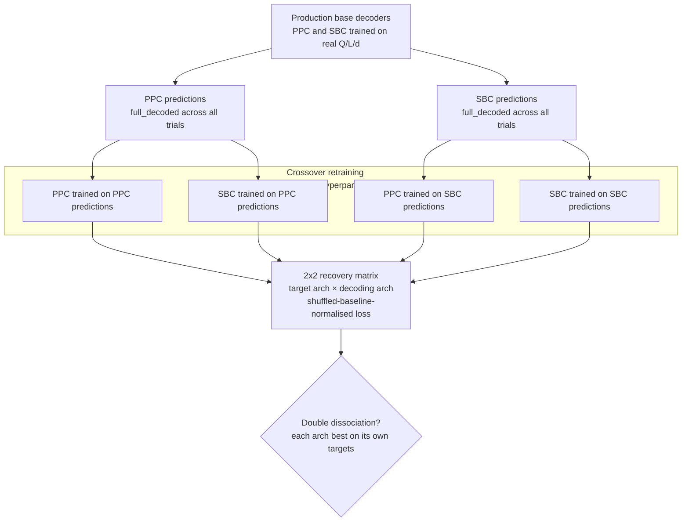

# Framework Diagrams

This page collects the framework-level diagrams for the project. They
render natively in the GitHub wiki via Mermaid; standalone SVGs are
also exported under `wiki/diagrams/` for use in slides and figures.

## 1. End-to-End Research Pipeline

From experiment to model comparison.

```mermaid
flowchart LR
    subgraph Exp[Stage 1 — Experiment]
        A1[Head-fixed mouse<br/>Go/No-Go grating task<br/>VR linear corridor]
        A2[2-photon imaging<br/>jGCaMP8 over V1]
        A3[Behaviour<br/>velocity, licks, choice]
    end

    subgraph Pre[Stage 2 — Preprocessing]
        B1[NoRMCorre<br/>motion correction]
        B2[Cellpose<br/>ROI segmentation]
        B3[FISSA<br/>neuropil subtraction]
        B4[CASCADE<br/>spike deconvolution]
        B5[roi_reg<br/>longitudinal alignment]
        B6[VR / imaging<br/>timestamp alignment]
    end

    subgraph IO[Stage 3 — Ideal Observer v2]
        C1[Stage 1: kinematics-only fit<br/>BADS, hierarchical, 5-fold CV]
        C2[Stage 2: choice psychometric<br/>4-param logistic on g&#40;m&#41;]
        C3[Marginalised inversion<br/>Q&#40;θ&#41;, L&#40;θ&#41;, decision posterior]
    end

    subgraph HMM[Stage 4 — GLM-HMM]
        D1[Engaged / biased / disengaged<br/>state inference]
        D2[Trial mask]
    end

    subgraph Dec[Stage 5 — Neural Decoder]
        E1[PPC architecture<br/>spatial integration]
        E2[SBC architecture<br/>temporal sampling]
        E3[Choice control<br/>direct binary readout]
        E4[Architecture-level recovery<br/>2x2 crossover]
    end

    F[Model comparison<br/>shuffled-baseline-normalised loss<br/>OOD generalisation]

    A1 --> A2 --> B1 --> B2 --> B3 --> B4
    A1 --> A3
    A2 -.repeat days.-> B5
    B4 --> B6
    A3 --> B6
    B6 --> C1 --> C2 --> C3
    B6 --> D1 --> D2
    C3 --> E1
    C3 --> E2
    C3 --> E3
    B6 --> E1
    B6 --> E2
    B6 --> E3
    D2 --> E1
    D2 --> E2
    D2 --> E3
    E1 --> E4
    E2 --> E4
    E1 --> F
    E2 --> F
    E3 --> F
    E4 --> F
```

## 2. Ideal Observer (v2) Framework

Two-stage hierarchical fit, then marginalised inversion.

```mermaid
flowchart TD
    subgraph Gen[Generative model — fixed]
        G1[Stimulus s<br/>contrast c, dispersion d]
        G2[m ~ VonMises&#40;s, κ&#40;c,d&#41;&#41;<br/>isotropic precision]
        G3[Prior p&#40;s&#41;: bimodal<br/>at 0° and 90°, κ_prior=3]
        G4[Bayes posterior p&#40;s&#124;m&#41;]
        G5[Utility U: R_hit=1, R_miss=0,<br/>R_cr=0.1, R_fa=−0.2]
        G6[DV&#40;m&#41; = EU&#40;Go&#124;m&#41; − EU&#40;NoGo&#124;m&#41;]
    end

    subgraph Em[Emissions]
        H1[y_vel = β_vel·DV + α_vel + 𝒩&#40;0,σ_vel&#41;]
        H2[y_lick = β_lick·DV + α_lick + 𝒩&#40;0,σ_lick&#41;]
    end

    subgraph S1[Stage 1 — kinematics only]
        S1a[BADS optimises<br/>κ_amp, p_c, p_d,<br/>β_vel, α_vel, σ_vel<br/>&#40;and lick params if enabled&#41;]
        S1b[Pooled fit ➜ per-animal seeds]
        S1c[5-fold CV ➜ OOS predictions]
    end

    subgraph S2[Stage 2 — choice psychometric]
        S2a[Bayes update on m using observed velocity]
        S2b[g&#40;m&#41; = log P&#40;Go&#124;m&#41;/P&#40;NoGo&#124;m&#41;]
        S2c[4-param logistic<br/>α_r, β_r, γ_r, δ_r]
        S2d[5-fold CV on choice params]
    end

    subgraph Inv[Marginalised inversion]
        I1[p&#40;m&#124;s_true, y_vel, y_lick&#41;]
        I2[Q&#40;θ&#41; = ∫ p&#40;s=θ&#124;m&#41; p&#40;m&#124;…&#41; dm]
        I3[L&#40;θ&#41; = ∫ p&#40;m&#124;s=θ&#41; p&#40;m&#124;…&#41; dm]
        I4[d_t = &#91;P&#40;Go_t&#41;, P&#40;NoGo_t&#41;&#93;<br/>= ∫ Q over 45° boundary]
    end

    G1 --> G2 --> G4
    G3 --> G4
    G4 --> G6
    G5 --> G6
    G6 --> H1
    G6 --> H2
    H1 --> S1a
    H2 -. optional .-> S1a
    S1a --> S1b --> S1c
    S1c --> S2a --> S2b --> S2c --> S2d
    S1c --> I1
    H1 --> I1
    H2 -. optional .-> I1
    G2 --> I1
    I1 --> I2
    I1 --> I3
    I2 --> I4
```

Key invariant: in Stage 2 velocity enters the choice probability *only*
through the Bayes update on the latent measurement `m`. It is never a
direct linear predictor of choice, so sensory precision `κ(c,d)` is
identified entirely by Stage 1.

## 3. Neural Decoder Framework

Shared MLP backbone, two architectures, four targets.

```mermaid
flowchart LR
    subgraph In[Inputs]
        X1[Deconvolved spikes<br/>r_n,t ∈ ℝ^U]
        X2[Late-half window<br/>1.0–2.0 s, 100 ms bins<br/>T = 10 bins/trial]
        X3[Z-score per neuron<br/>training-fold-only stats]
    end

    subgraph Targets
        T1[Q&#40;θ&#41; — perceptual posterior<br/>91-bin distribution<br/>Loss: PCA-weighted]
        T2[L&#40;θ&#41; — marginalised likelihood<br/>91-bin distribution<br/>Loss: PCA-weighted]
        T3[d_t — decision posterior<br/>2-D soft probability<br/>Loss: MSE]
        T4[Choice — binary report<br/>2-D one-hot<br/>Loss: cross-entropy]
    end

    subgraph Arch[Shared MLP backbone f_φ]
        F1[fc1: U → 32]
        F2[tanh activation]
        F3[fc2: 32 → 91 or 2]
        F4[Xavier-uniform init]
    end

    subgraph PPC[PPC — Spatial]
        P1[mean over T bins]
        P2[f_φ + softmax]
        P3[Loss: 𝒟&#40;Q, P_PPC&#41;]
    end

    subgraph SBC[SBC — Temporal]
        S1[f_φ + softmax per bin]
        S2[Pbar = mean over T bins]
        S3[Loss: 𝒟&#40;Q, Pbar&#41;<br/>+ λ_H · &#60;H_inst&#62;]
    end

    Train[Training:<br/>Adam lr=1e-3, wd=3e-4<br/>30 epochs, accum 16 trials<br/>‖∇‖₂ ≤ 1.0<br/>REP = 5, retain min train loss]

    Eval[50/50 stratified split<br/>+ shuffled baseline<br/>+ OOD splits]

    X1 --> X2 --> X3
    X3 --> P1 --> P2 --> P3
    X3 --> S1 --> S2 --> S3
    F1 --> F2 --> F3
    F4 --> F1
    F1 -.shared.-> P2
    F1 -.shared.-> S1
    P3 --> Train
    S3 --> Train
    T1 --> P3
    T1 --> S3
    T2 --> P3
    T2 --> S3
    T3 --> P3
    T3 --> S3
    T4 --> P3
    T4 --> S3
    Train --> Eval
```

## 4. Architecture-Level Recovery (Double Dissociation)

Tests whether one architecture is just a more powerful function
approximator.

A genuine architectural difference shows as a double dissociation: PPC
should achieve lower loss on PPC-generated targets than SBC does, and
vice versa. Failure of this dissociation would indicate that the
apparent architectural advantage in the real-data fits is driven by
expressivity rather than representation.
