# UncertaintyV1 Project Wiki

Welcome to the documentation for the **Representation of Perceptual
Uncertainty in Mouse V1** project.

This project investigates how the brain represents uncertainty during
visual discrimination. We compare two theoretical frameworks:
1.  **Probabilistic Population Codes (PPC)** — spatial representation
    across neurons.
2.  **Sampling-Based Codes (SBC)** — temporal representation via
    sequential samples.

## Project Architecture

The project is organised into modular pipelines that transform raw
experimental data into theoretical insights.

```mermaid
graph LR
    A[Experiment<br/>VR + 2-photon] -->|TIFFs, VR logs| B[Preprocessing<br/>NoRMCorre, Cellpose,<br/>FISSA, CASCADE, roi_reg]
    B -->|kinematics| C[Ideal Observer v2<br/>two-stage hierarchical fit]
    B -->|deconvolved spikes| E
    B -->|behaviour| D[GLM-HMM<br/>state filter]
    C -->|Q&#40;θ&#41;, L&#40;θ&#41;, decision posterior| E[Neural Decoder<br/>PPC vs SBC]
    D -->|engaged-trial mask| E
    E -->|architecture-level recovery| E
    E --> F[Results & Analysis]
```

For detailed framework diagrams (IO two-stage fit, NN decoder
architectures and recovery crossover) see
[Diagrams](Diagrams.md).

## Wiki Sections

### 1. [Pipeline Overview](Pipeline.md)
End-to-end data flow from mouse to model.

### 2. [Diagrams](Diagrams.md)
Framework diagrams for the IO model, the NN decoder, and the
architecture-level recovery crossover.

### 3. [Experimental Control](Module_Experiment.md)
ViRMEn-based VR setup and hardware control.

### 4. [Data Preprocessing](Module_Preprocessing.md)
Motion correction, segmentation, neuropil subtraction, spike
deconvolution, ROI registration.

### 5. [Behavioural Modelling (Ideal Observer)](Module_IdealObserver.md)
Two-stage hierarchical fit; trial-by-trial `Q(theta)`, `L(theta)`, and
the decision posterior.

### 6. [State Discovery (GLM-HMM)](Module_GLMHMM.md)
Engaged-state filter for downstream decoding.

### 7. [Neural Decoding (PPC vs SBC)](Module_NeuralDecoder.md)
PyTorch decoders, three distributional targets + choice control,
architecture-level recovery.
