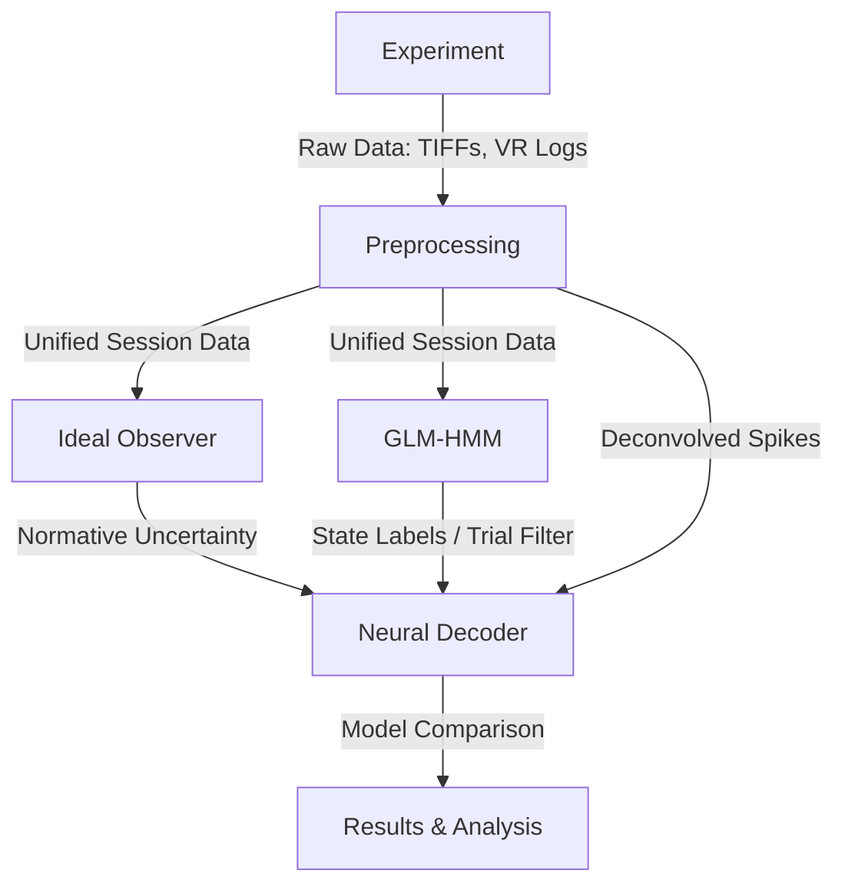

# UncertaintyV1 Project Wiki

Welcome to the documentation for the **Representation of Perceptual Uncertainty in Mouse V1** project.

This project investigates how the brain represents uncertainty during visual discrimination. We compare two theoretical frameworks:
1.  **Probabilistic Population Codes (PPC)**: Spatial representation across neurons.
2.  **Sampling-Based Codes (SBC)**: Temporal representation via sequential samples.

## Project Architecture

The project is organized into modular pipelines that transform raw experimental data into theoretical insights.

## Wiki Sections

### 1. [Pipeline Overview](Pipeline.md)
A high-level description of the data flow from mouse to model.

### 2. [Experimental Control](Module_Experiment.md)
Details on the ViRMEn-based VR setup and hardware control.

### 3. [Data Preprocessing](Module_Preprocessing.md)
The pipeline for motion correction, segmentation, and spike deconvolution.

### 4. [Behavioural Modelling (Ideal Observer)](Module_IdealObserver.md)
Extracting normative uncertainty from mouse kinematics.

### 5. [State Discovery (GLM-HMM)](Module_GLMHMM.md)
Isolating engaged perceptual states from task-disengaged behavior.

### 6. [Neural Decoding (PPC vs SBC)](Module_NeuralDecoder.md)
Deep learning architecture for evaluating uncertainty representations in V1.
